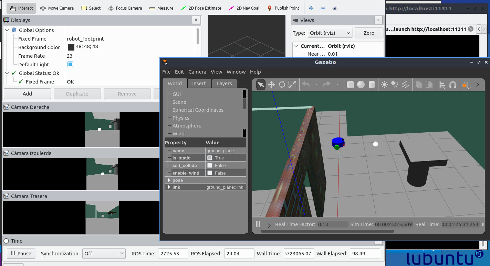

# URDF-4
En esta rama se ha modificado el robot de la rama 3 añadiéndole dos cámaras.
Dos de las cámaras están situadas simétricamente en el frontal del robot a
modo de ojos, y la tercera está situada detrás alineada con el eje x.



# robomechtrix_ws
Robomechtrix Workspace For ROS

This repo includes how to build a robot using ROS URDF.

## Dependencies for the package

```
Xacro - sudo apt-get install ros-<version>-xacro
Gazebo - sudo apt-get install ros-<version>-gazebo-ros
```

## If you are here after the first video on ROS URDF
To clone, build and run the ROS package
```
git clone https://github.com/PranaliDesai/robomechtrix_ws.git
cd robomechtrix_ws
git checkout URDF-4
catkin_make
source devel/setup.bash
roslaunch trixy world.launch
```
